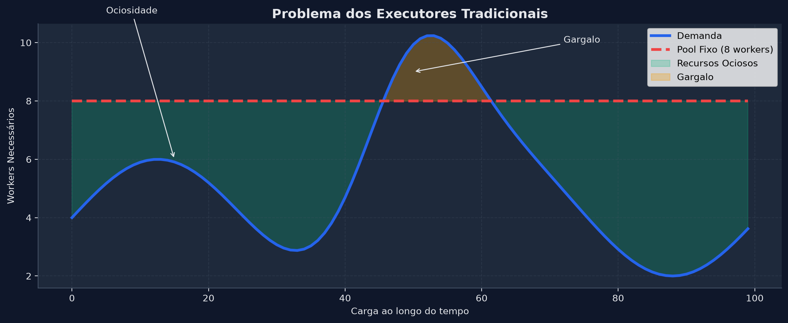
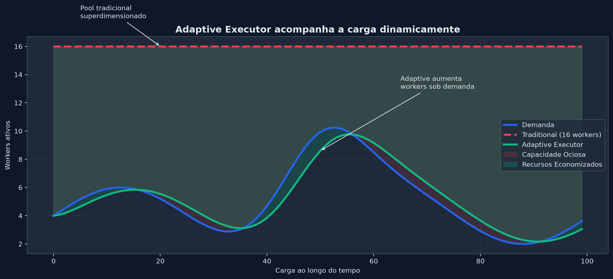
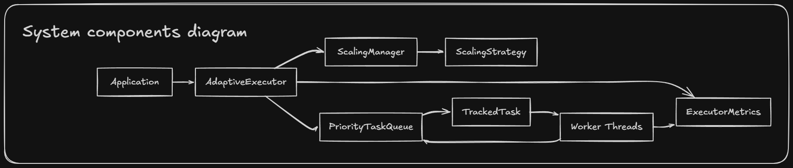
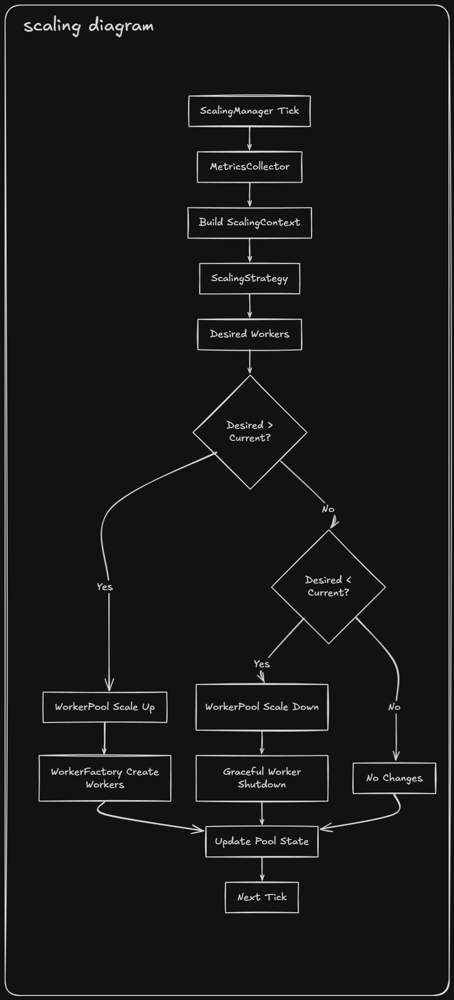
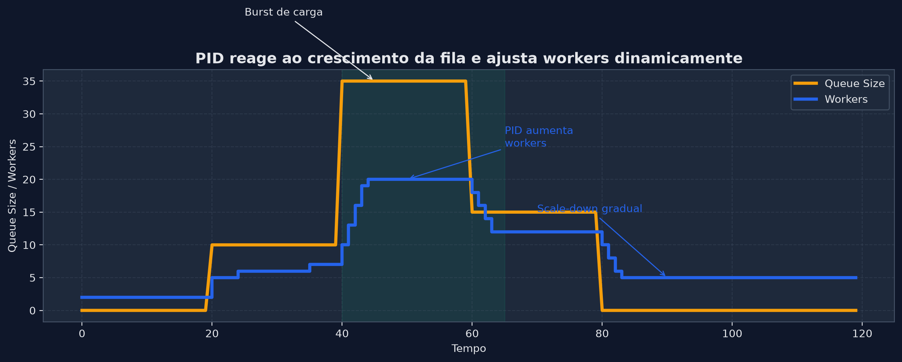
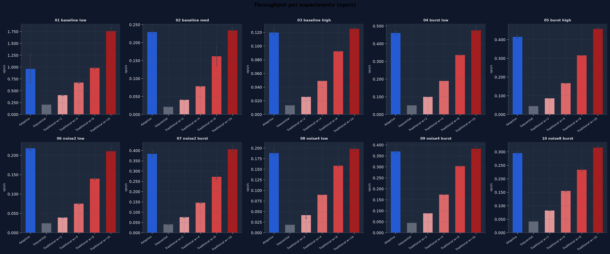
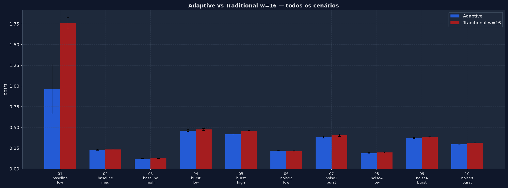
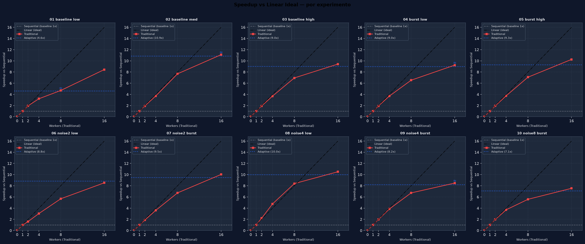

# Adaptive Executor Benchmark

Benchmark project for evaluating adaptive thread pool execution strategies using [JMH (Java Microbenchmark Harness)](https://github.com/openjdk/jmh).

The goal is to compare throughput, scalability, and resilience under CPU contention between traditional fixed thread pools and an adaptive executor capable of dynamically scaling workers based on workload conditions.

The project simulates real-world noisy neighbour scenarios commonly found in shared infrastructure environments, containerized workloads, and cloud environments.

---

# Motivation

Traditional executors require choosing a fixed thread count ahead of time.

This creates a trade-off:

- Too few workers → throughput bottlenecks during traffic spikes.
- Too many workers → resource waste and unnecessary context switching.

The Adaptive Executor attempts to solve this problem by continuously adjusting the worker pool size according to workload demand.

### Traditional Fixed Pool



A fixed-size pool must choose between idle resources and insufficient capacity.

### Adaptive Scaling



The adaptive executor dynamically increases or decreases worker count according to workload pressure.

---

# Executors

## Sequential Executor

Executes all tasks sequentially in a single thread.

Used as the baseline for speedup calculations.

---

## Traditional Executor

Fixed-size thread pool using:

```java
Executors.newFixedThreadPool(n)
```

Benchmarked with:

```text
workers = {2, 4, 8, 16}
```

to evaluate how throughput scales with increasing parallelism.

---

## Adaptive Executor

Dynamic thread pool backed by a priority queue and a PID-based scaling strategy.

Workers are created and destroyed at runtime according to:

- Queue pressure
- CPU utilization
- Throughput feedback

Tasks are scheduled by priority:

- HIGH priority tasks always execute first
- LOW priority tasks execute when capacity is available

### Components

| Component          | Description                                      |
| ------------------ | ------------------------------------------------ |
| PriorityTaskQueue  | PriorityBlockingQueue-backed task queue          |
| ScalingManager     | Periodic scaling evaluation thread               |
| PidScalingStrategy | PID controller responsible for scaling decisions |
| ExecutorMetrics    | Lock-free runtime metrics                        |
| WorkerPool         | Dynamic worker lifecycle management              |

---

# Architecture



The adaptive executor consists of a priority-aware task queue, a scaling manager, and a PID controller responsible for determining the optimal worker count.

The scaling manager periodically evaluates runtime conditions and adjusts the worker pool accordingly.

---

# Scaling Flow



Scaling decisions are performed periodically:

1. Read queue size.
2. Read CPU utilization.
3. Compute PID output.
4. Determine desired worker count.
5. Scale up or down.
6. Repeat continuously.

---

# Workloads

## Payment Task (HIGH priority)

Simulates I/O-bound work such as payment processing.

```properties
payment.sleep.ms=10
workload.payments=100
```

---

## Analytics Task (LOW priority)

Simulates CPU-intensive analytical workloads.

```properties
analytics.iterations=100000000
workload.analytics=100
```

---

## Burst Task (HIGH priority)

Simulates sudden workload spikes.

Designed to stress scaling responsiveness.

```properties
workload.bursts=50
burst.iterations=5000000
burst.pause.ms=5
burst.count=3
```

---

# Noise Generator

Simulates noisy neighbour CPU contention.

Background threads continuously consume CPU resources during benchmark execution.

```properties
noise.enabled=true
noise.threads=4
```

---

# PID Scaling Strategy

The adaptive executor uses a PID controller to determine the desired worker count.

### PID Behaviour



The controller reacts to queue growth by increasing worker count and gradually scales down as pressure decreases.

Current implementation includes:

- Proportional term (P)
- Integral term (I)
- Derivative term (D)
- Anti-windup protection
- Controlled scale-up
- Controlled scale-down

---

# Configuration

All benchmark parameters are defined in:

```text
src/main/resources/application.properties
```

Example:

```properties
# Workloads
workload.payments=50
workload.analytics=50
workload.bursts=50

# Payment simulation
payment.sleep.ms=10

# Analytics simulation
analytics.iterations=100000000

# Burst simulation
burst.iterations=5000000
burst.pause.ms=5
burst.count=3

# Traditional executor configurations
executor.workers=2,4,8,16

# Noise simulation
noise.enabled=false
noise.threads=4
```

---

# Building

```bash
mvn clean package
```

Output:

```text
target/benchmarks.jar
```

> Note: application.properties is packaged into the JAR. Configuration changes require rebuilding.

---

# Running

## Single Run

```bash
java -jar target/benchmarks.jar ".*Benchmark.*" -rf csv -rff results.csv -wi 3 -i 5 -f 2
```

## JMH Parameters

| Parameter | Description            | Recommended     |
| --------- | ---------------------- | --------------- |
| -wi       | Warmup iterations      | 3               |
| -i        | Measurement iterations | 5               |
| -f        | Fork count             | 2               |
| -rf       | Result format          | csv             |
| -rff      | Output file            | results/exp.csv |

---

## Individual Benchmarks

```bash
java -jar target/benchmarks.jar AdaptiveBenchmark
```

```bash
java -jar target/benchmarks.jar TraditionalBenchmark
```

```bash
java -jar target/benchmarks.jar SequentialBenchmark
```

---

# Automated Experiment Suite

The project includes a PowerShell script that automatically executes all planned benchmark scenarios.

```powershell
.\run_experiments.ps1
```

Results are stored under:

```text
results/
```

| File                 | Scenario            |
| -------------------- | ------------------- |
| 01_baseline_low.csv  | Low load            |
| 02_baseline_med.csv  | Medium load         |
| 03_baseline_high.csv | High load           |
| 04_burst_low.csv     | Light burst         |
| 05_burst_high.csv    | Heavy burst         |
| 06_noise2_low.csv    | Light noise         |
| 07_noise2_burst.csv  | Light noise + burst |
| 08_noise4_low.csv    | Heavy noise         |
| 09_noise4_burst.csv  | Heavy noise + burst |
| 10_noise8_burst.csv  | Extreme noise       |

---

# Result Visualization

Requirements:

```bash
pip install pandas matplotlib numpy
```

Generate charts:

```bash
python generate_charts.py
```

Generated files:

| File                             | Description                    |
| -------------------------------- | ------------------------------ |
| 00_fixed_pool_problem.png        | Motivation diagram             |
| 01_throughput_per_experiment.png | Throughput comparison          |
| 02_adaptive_vs_traditional16.png | Adaptive vs Traditional        |
| 03_noise_degradation.png         | Noise degradation              |
| 04_speedup_over_sequential.png   | Adaptive speedup               |
| 05_speedup_linear.png            | Speedup vs linear ideal        |
| 06_adaptive_executor.png         | Adaptive scaling visualization |
| 07_pid_controller.png            | PID controller behaviour       |
| summary.csv                      | Consolidated results           |

---

# Sample Results

## Throughput Comparison



---

## Adaptive vs Traditional



---

## Speedup vs Linear Ideal



---

# Interpreting Results

- Speedup is computed relative to the Sequential benchmark.
- Linear ideal represents perfect parallel scalability.
- Adaptive speedup is represented as the equivalent fixed pool size it autonomously achieved.
- adaptive*vs_best*% compares Adaptive Executor against the best Traditional Executor configuration.

Positive values indicate that the adaptive executor outperformed the best fixed pool.

---

# Highlights

Current experiments demonstrate:

- Dynamic scaling without manual worker configuration.
- Priority-aware task scheduling.
- Reduced sensitivity to noisy neighbour CPU contention.
- Comparable throughput to large fixed thread pools.
- Automatic adaptation to workload bursts.

---

# Roadmap

## V1 — Adaptive Scaling (Current)

Dynamic worker scaling using queue pressure, CPU awareness, priority scheduling and PID control.

## V2 — SLA Aware (Planned)

Deadlines, dynamic priorities and response-time targets.

## V3 — Self-Tuning (Planned)

Automatic PID tuning, workload pattern detection and predictive scaling.

---

# Notes

- Results vary depending on hardware, JVM version, operating system and background activity.
- Always compare executors using the same benchmark configuration.
- The adaptive executor introduces a scaling reaction delay (~200ms).
- CPU-aware scaling moderates scale-up under saturation conditions.
- Benchmarks focus on throughput behaviour and scaling characteristics rather than latency guarantees.

## Benchmark Environment

All benchmark results were executed on:

| Component | Specification                   |
| --------- | ------------------------------- |
| CPU       | Intel Core i5-12400F (6C / 12T) |
| RAM       | 32 GB DDR4 3200 MHz             |
| Storage   | 512 GB NVMe SSD + 1 TB SATA SSD |
| GPU       | NVIDIA RTX 4060 Ti              |
| Network   | 1 Gbps Ethernet                 |
| OS        | Windows 11 Pro                  |
| Java      | OpenJDK 21                      |

---

# License

MIT License
